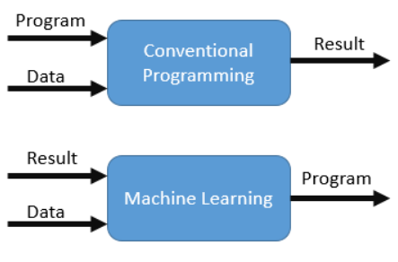
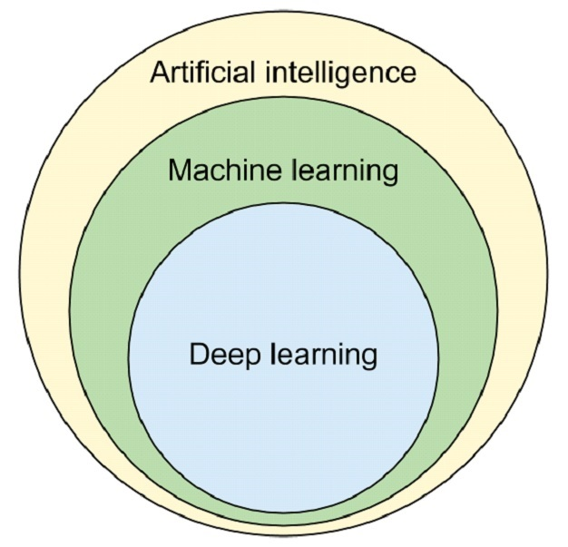

# What is Machine Learning ?

Machine learning is a branch of artificial intelligence (AI) and computer science which focuses on the use of data and algorithms to imitate the way that humans learn, gradually improving its accuracy. The primary concern of machine learning is to design and analyse the algorithms which enable computers to learn. 

Machine learning is the science where in order to predict a value, algorithms are applied for a system to learn patterns within data. With the use of sufficient data, the relationship between all of the input variables and the values to be predicted is established. 

It becomes easier for the system to predict a new value given other input variables. This approach differs from conventional programming where an application is developed based on previously set rules.

The difference between conventional programming and machine learning is shown in the following diagram.

Even though the fundamental concepts of machine learning have been around for a while, the field has gained momentum recently due to the state-of-the-art processors and the abundant data that's available, which are both key to achieving accurate predictions.

Machine learning algorithms are used in a wide variety of applications, such as in medicine, email filtering, speech recognition, and computer vision, where it is difficult or unfeasible to develop conventional algorithms to perform the needed tasks.

Arthur Samuel, is credited for coining the term, "machine learning" with his research around the game of checkers. According to him, "machine learning is the field of study that gives computers the ability to learn without being explicitly programmed".

Tom M. Mitchell provided a widely quoted, more formal definition of the algorithms studied in the machine learning field: "A computer program is said to learn from experience E with respect to some class of tasks T and performance measure P if its performance at tasks in T, as measured by P, improves with experience E."

Let us understand the definition of machine learning by mapping it to the real world examples. Let us consider self-driving car :
* Task T is driving on roads with computer vision and sensors
* Measure P is the average distance traveled without an error
* Experience E is a sequence of images and steering commands of human

Though there are disagreements, many sources continue to assert that machine learning remains a subfield of AI. The following diagram shows the relationship between the different fields such as artificial intelligence, machine learning and deep learning. Here, deep learning is a sub-field in machine learning. It consists of methods related to artificial neural networks.

Deep learning is a sub-field in machine learning. It consists of methods related to artificial neural networks.
