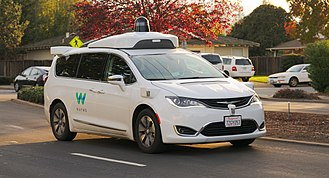
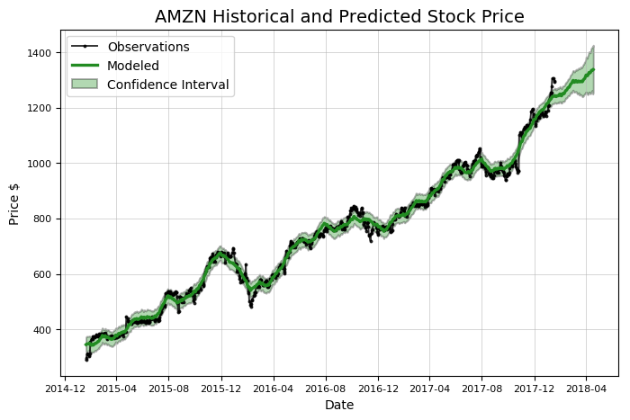
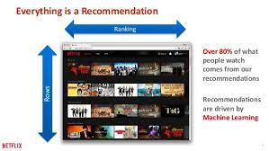

# Machine Learning Examples

Machine learning algorithms are widely used in real world. Let us see few examples where machine learning is being applied and decode how they can be fit into machine learning paradigm.

Let us look at the autonomous driving or self-driving cars example. In autonomous driving the goal of the machine learning algorithm is to drive and control the vehicle. Let us decode self-driving car application into machine learning definition.

In Self-driving Cars :
* Task T is the driving on roads with computer vision and sensors
* Measure P is the average distance traveled without an error
* Experience E is a sequence of images and steering commands of human

Let us take a stock trading example where machine learning algorithms are extensively used. The goal of the machine learning algorithms is to create buy and sell orders in order maximize profit. Let us see how stock trading problem can be fit into machine learning definition.

In Stock Markets :
* Task T is to buying or selling a stock 
* Measure P is average loss or profit made 
* Experience E is a sequence of stock prices and buy/sell decisions

Let us look into another popular machine learning system example named recommender systems. The goal of the recommender system is to suggest the content such as videos for the end users. Such popular systems can be seen in YouTube or Netflix etc. The recommender system example can be fit into machine learning example in the following way.

In Recommender Systems :
* Task T is to suggest videos to watch next
* Measure P is the number of clicks
* Experience E is the collection of users and items

With these examples for understanding the machine learning definition and how it is being used, Let us look into how machine learning algorithms are classified.