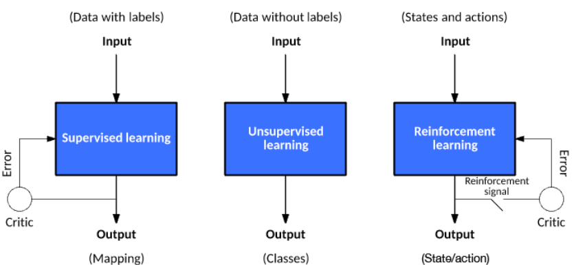

# Classification of Machine Learning

Machine-learning algorithms continue to grow and evolve. In most cases, however, algorithms tend to settle into one of three models for learning. The models exist to adjust automatically in some way to improve their operation or behavior.

Three categories of algorithms used in machine learning are: 
1. Supervised Learning
2. Unsupervised Learning
3. Reinforcement Learning

**Supervised learning** involves feedback to indicate when a prediction is right or wrong.

**Unsupervised learning** involves no response: The algorithm simply tries to categorize data based on its hidden structure.

**Reinforcement learning** is similar to supervised learning in that it receives feedback, but it’s not necessarily for each input or state. This tutorial explores the ideas behind these learning models and some key algorithms used for each.

Machine-learning algorithms continue to grow and evolve. In most cases, however, algorithms tend to settle into one of three models for learning. The models exist to adjust automatically in some way to improve their operation or behavior.

The pictorial interpretation of the different machine learning algorithm types are given as follows:

In **supervised learning**, a data set includes its desired outputs (or labels) such that a function can calculate an error for a given prediction. The supervision comes when a prediction is made and an error produced (actual vs. desired) to alter the function and learn the mapping.

In **unsupervised learning**, a data set doesn't include a desired output; therefore, there's no way to supervise the function. Instead, the function attempts to segment the data set into "classes" so that each class contains a portion of the data set with common features.

Finally, in **reinforcement learning**, the algorithm attempts to learn actions for a given set of states that lead to a goal state. An error is provided not after each example (as is the case for supervised learning) but instead on receipt of a reinforcement signal (such as reaching the goal state). This behavior is similar to human learning, where feedback isn't necessarily provided for all actions but when a reward is warranted.

There are other class of machine learning algorithms like **semi-supervised learning** that offers a happy medium between supervised and unsupervised learning. During training, it uses a smaller labeled data set to guide classification and feature extraction from a larger, unlabeled data set. Semi-supervised learning can solve the problem of having not enough labeled data (or not being able to afford to label enough data) to train a supervised learning algorithm.

Now, let's see more details of each model and examine their approaches in detail.
