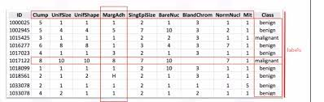
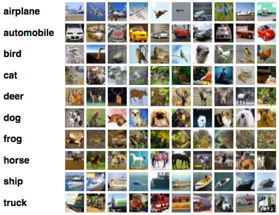

# Introduction to Supervised Learning

Supervised learning, also known as supervised machine learning refers to the type of problems in which each record in the the data set contains a label or a flag. 

Supervised learning algorithms use the data set that includes the label to train algorithms that classify data or predict outcomes accurately.

Let us looks at some of the labeled training sets. In tumor detection problem, the labeled training set might look like the following.

Here, the column named "class" can be understood as a label corresponding to the other column values describing the tumor.

Let us look at another example where the task is to identify the images. The labeled training example might look like the following.

Here, the data set consists of images and the label would be name of the object in the image.

The goal of the supervise learning algorithm is to predict the future for unlabeled data. Once supervised algorithm is trained, you fit unlabeled data or query data into your algorithm, and the algorithm now predicts a label for this data.

That is, given a set of $N$ training examples of the form $\{(x_{1},y_{1}),...,(x_{N},\;y_{N})\}$ such that $x_{i}$ is the feature vector of the i-th example and $y_{i}$ is its label, a learning algorithms goal is to learn a function $g: X \to Y$, where $X$ is the input space and $Y$ is the output space. 

Often $g$ is called model. The $x$'s are called independent variables or features and $y$ is called dependent variable or target variable.

During the training process, as input data is fed into the model, it adjusts its weights until the model has been fitted appropriately. Supervised learning helps organizations solve for a variety of real-world problems at scale.

## How supervised learning algorithm works ?

Supervised learning uses a training set to teach models to yield the desired output. This training dataset includes inputs and correct outputs, which allow the model to learn over time. 

The algorithm measures its accuracy through the loss function, adjusting until the error has been sufficiently minimized.

Supervised learning can be separated into two types of problems :
 1. Regression
 2. Classification

Based on the type of output variable the supervised learning algorithm need to predict, the supervised learning algorithms are categorized into two types.

## Introduction to Regression

Regression is used to understand the relationship between dependent and independent variables. The type of use cases where a continuous value or a number must be predicted is referred to as regression.

It is commonly used to make projections, such as stock price, weather etc. In these applications the variable the algorithm needs to predict is continuous, i.e, it can take many values.

## Introduction to Classification

The type of use cases where the output is a binary value or at least a discrete value instead of a continuous value is referred to as classification.

In other words, the algorithm does not predict a number, but instead predicts a class variable.

Some methods used in supervised learning include neural networks, naive bayes, linear regression, logistic regression, random forest, support vector machine (SVM), and more.

## Supervised Learning Examples

Supervised learning models can be used to build and advance a number of business applications, including the following:

- **Image and object recognition:** Supervised learning algorithms can be used to locate, isolate, and categorize objects out of videos or images, making them useful when applied to various computer vision techniques and imagery analysis.

- **Predictive analytics:** A widespread use case for supervised learning models is in creating predictive analytics systems to provide deep insights into various business data points. This allows enterprises to anticipate certain results based on a given output variable, helping business leaders justify decisions or pivot for the benefit of the organization.

- **Customer sentiment analysis:** Using supervised machine learning algorithms, organizations can extract and classify important pieces of information from large volumes of data—including context, emotion, and intent—with very little human intervention. This can be incredibly useful when gaining a better understanding of customer interactions and can be used to improve brand engagement efforts.

- **Spam detection:** Spam detection is another example of a supervised learning model. Using supervised classification algorithms, organizations can train databases to recognize patterns or anomalies in new data to organize spam and non-spam-related correspondences effectively.