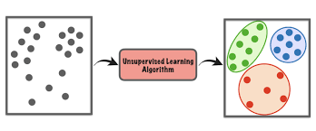
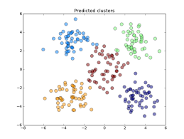
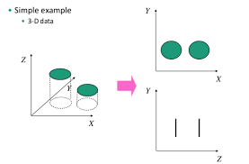
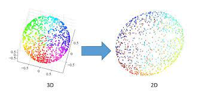

# Introduction to Unsupervised Learning

Unsupervised learning, also known as unsupervised machine learning, uses machine learning algorithms to analyze and cluster unlabeled datasets.

These algorithms discover hidden patterns or data groupings without the need for human intervention. Its ability to discover similarities and differences in information make it the ideal solution for exploratory data analysis, cross-selling strategies, customer segmentation, image and pattern recognition.

It's also used to reduce the number of features in a model through the process of dimensionality reduction.

## Approaches of Unsupervised Learning

Unsupervised learning models are utilized for three main tasks—clustering, association, and dimensionality reduction. Below we'll define each learning method and highlight common algorithms and approaches to conduct them effectively.

## Clustering

Clustering is a unsupervised learning technique which groups unlabeled data based on their similarities or differences. Clustering algorithms are used to process raw, unclassified data objects into groups represented by structures or patterns in the information. Let us see the clustering diagrammatically :

The goal of the unsupervised learning algorithm is to predict the clusters given unlabelled data.

## Dimensionality Reduction

While more data generally yields more accurate results, it can also impact the performance of machine learning algorithms and it can also make it difficult to visualize datasets. 

Dimensionality reduction is a technique used when the number of features, or dimensions, in a given dataset is too high. It reduces the number of data inputs to a manageable size while also preserving the integrity of the dataset as much as possible. It is commonly used in the preprocessing data stage.

Let us understand the dimensionality reduction pictorially. The following picture present how data in three dimensions (3D) can be reduced to two or one dimensions.

## Applications of Unsupervised Learning

Machine learning techniques have become a common method to improve a product user experience and to test systems for quality assurance. Unsupervised learning provides an exploratory path to view data, allowing businesses to identify patterns in large volumes of data more quickly when compared to manual observation. Some of the most common real-world applications of unsupervised learning are:

- **News Sections:** Google News uses unsupervised learning to categorize articles on the same story from various online news outlets. For example, the articles related to india could be categorized under their label for "India" news.

- **Computer vision:** Unsupervised learning algorithms are used for visual perception tasks, such as object recognition.

- **Medical imaging:** Unsupervised machine learning provides essential features to medical imaging devices, such as image detection, classification and segmentation, used in radiology and pathology to diagnose patients quickly and accurately.

- **Anomaly detection:** Unsupervised learning models can comb through large amounts of data and discover atypical data points within a dataset. These anomalies can raise awareness around faulty equipment, human error, or breaches in security.

- **Customer personas:** Defining customer personas makes it easier to understand common traits and business clients' purchasing habits. Unsupervised learning allows businesses to build better buyer persona profiles, enabling organizations to align their product messaging more appropriately.

- **Recommendation Engines:** Using past purchase behavior data, unsupervised learning can help to discover data trends that can be used to develop more effective cross-selling strategies. This is used to make relevant add-on recommendations to customers during the checkout process for online retailers.
