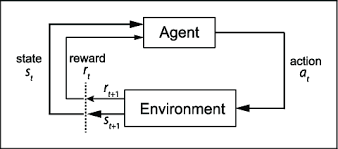

# Introduction to Reinforcement Learning

Reinforcement learning is a subfield of machine learning that you can use to train a software agent to behave rationally in an environment. The agent is rewarded based on the actions it takes within the environment.

The following diagram summarizes the reinforcement learning setting. 

Reinforcement machine learning is a behavioral machine learning model that is similar to supervised learning, but the algorithm isn't trained using sample data.

This model learns as it goes by using trial and error. A sequence of successful outcomes will be reinforced to develop the best recommendation or policy for a given problem.

Reinforcement learning is different from either of the two learning approaches like supervised learning or unsupervised learning but sides more with the supervised end of the spectrum. 

In reinforcement learning, the mapping of state to action is learned through a cumulative reward or punishment for its actions. 

The mapping takes place online, through a balance of exploration (trying new actions for a given state) and exploitation (by using existing knowledge of the state/action mapping). 

The goal of learning algorithm is to find optimal state action sequence so that it can maximize the cumulative reward over time.

## Applications of Reinforcement Learning

Let us look at look at some of the real-world applications of reinforcement learning.

- **Self-driving Cars:** In self-driving cars, there are various aspects to consider, such as speed limits at various places, drivable zones, avoiding collisions — just to mention a few. Some of the autonomous driving tasks where reinforcement learning could be applied include trajectory optimization, motion planning, dynamic patching, controller optimization, and scenario-based learning policies for highways.

- **Robotics:** In industry, reinforcement learning-based robots are used to perform various tasks. Apart from the fact that these robots are more efficient than human beings, they can also perform tasks that would be dangerous for people.  

- **Other Applications:** There are many other places reinforcement learning algorithms are used quite extensively. Some of them are industrial automation and autonomous trading etc..

