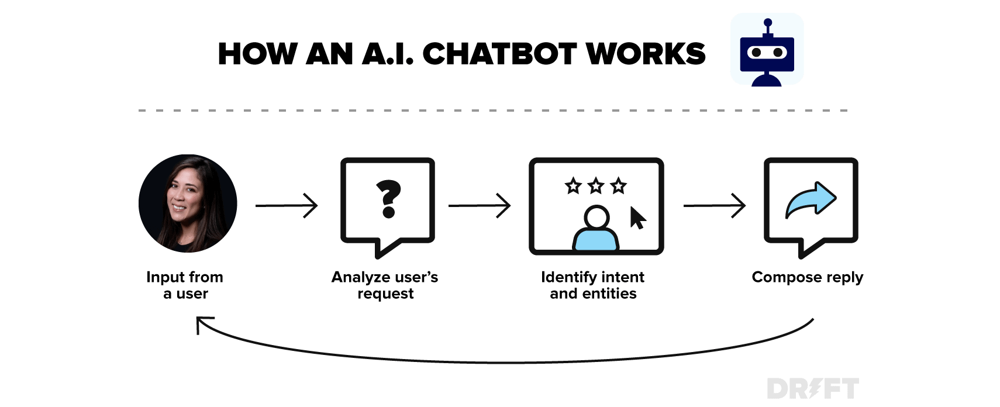

# Real-world Machine Learning Use cases

Here are just a few examples of machine learning you might encounter every day:

**Speech Recognition:** It is also known as automatic speech recognition (ASR), computer speech recognition, or speech-to-text, and it is a capability which uses natural language processing (NLP) to process human speech into a written format. Many mobile devices incorporate speech recognition into their systems to conduct voice search—e.g. Siri—or provide more accessibility around texting.

**Customer Service:**  Online chatbots are replacing human agents along the customer journey. They answer frequently asked questions (FAQs) around topics, like shipping, or provide personalized advice, cross-selling products or suggesting sizes for users, changing the way we think about customer engagement across websites and social media platforms. Examples include messaging bots on e-commerce sites with virtual agents, messaging apps, such as Slack and Facebook Messenger, and tasks usually done by virtual assistants and voice assistants.

**Computer Vision:** This AI technology enables computers and systems to derive meaningful information from digital images, videos and other visual inputs, and based on those inputs, it can take action. This ability to provide recommendations distinguishes it from image recognition tasks. Powered by convolutional neural networks, computer vision has applications within photo tagging in social media, radiology imaging in healthcare, and self-driving cars within the automotive industry.

**Recommendation Engines:** Using past consumption behavior data, AI algorithms can help to discover data trends that can be used to develop more effective cross-selling strategies. This is used to make relevant add-on recommendations to customers during the checkout process for online retailers.

**Automated stock trading:** Designed to optimize stock portfolios, AI-driven high-frequency trading platforms make thousands or even millions of trades per day without human intervention.

