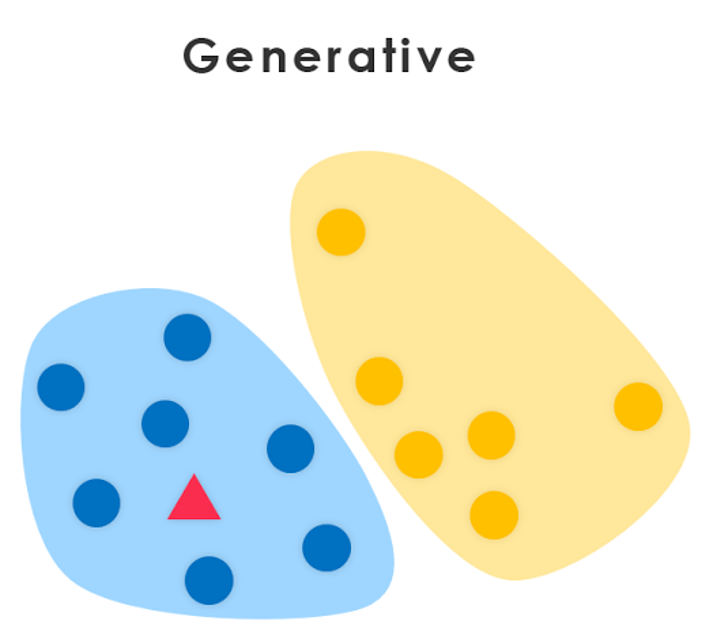

# Introduction to Generative Learning Algorithms

Generative approaches try to build a model of the positives and a model of the negatives. You can think of a model as a "blueprint" for a class. A decision boundary is formed where one model becomes more likely. As these create models of each class they can be used for generation.

Continuing the example of classification of elephants and dogs. Let us look at the generative learning algorithm's approach. 

First, looking at elephants, we can build a model of what elephants look like. Then, looking at dogs, we can build a separate model of what dogs look like.

Finally, to classify a new animal, we can match the new animal against the elephant model, and match it against the dog model, to see whether the new animal looks more like the elephants or more like the dogs we had seen in the training set.

To create these models, a generative learning algorithm learns the joint probability distribution $p(x,y)$.

The joint probability can be written as:
$$p(x,y) = p(x|y)\,p(x)$$

Also, using Bayes’ Rule we can write:
$$p(y|x) = p(x|y)\,\, \frac{p(y)}{p(x)}$$

As, we have seen in the discriminative learning algorithms that in order to predict a class label $y$, we are only interested in the arg max of $p(y|x)$.

For finding the $y$ that maximizes $p(y|x)$, we can ignore the $p(x)$ in the above equation since it does not depend on $y$. The resulting optimization problem can be written as: 
$${\underset {y}{\operatorname {arg\,\, max}}} \,\,p(x|y)\,\,p(y)$$

Hence to predict the label $y$ from the training example $x$, generative models evaluate:
$$f(x) = {\underset {y}{\operatorname  {arg\,\, max}}} \,\,p(y|x) = {\underset {y}{\operatorname {arg\,\, max}}} \,\,p(x|y)\,\,p(y)$$

Here, the most important part is that $p(x|y)$. This allows the model to be generative. This can be interpreted as "probability of features $x$ given a class $y$". It means that "what $x$ (features) are there given class $y$".

Hence, with the joint probability distribution function given a $y$, you can calculate ("generate") its corresponding x. For this reason they are called **generative models**.

