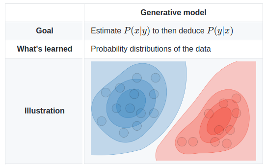

# Generative Learning Algorithms Framework

Generative algorithms make a strong assumption on the data. For example, it can assume that the data is distributed as multi-variate Gaussian. In some other cases, it can assume that each feature is independent of other features in the data. 

On the contrary, discriminative algorithms make weak assumptions on the data compared to generative learning algorithms.

Let us understand the generative learning algorithms framework through example.

Suppose the input data is $x\in \{1\,\,\text{(animal)},\,2\,\,(\text{long ears})\}$, the set of labels for $x$ is denoted by $y$ and $y\in \{0 \,\,(\text{elephants}), 1\,\,(\text{dog})\}$. There are the following 4 data points: $(x,y)=\{(1,0),(1,1),(2,0),(2,0)\}$

For the above data, estimating the joint probability distribution $p(x,y)$ from the empirical measure will be the following:

| |$y=0$ (elephant)| $y=1$ (dog)|
| :--: | :--: | :--: |
| $x=1$ (animal) | $\frac{1}{4}$ | $\frac{1}{4}$ |
| $x=2$ (long ears) | $\frac{1}{2}$ | $0$ |

From the above table, we can compute $p(y)$ and $p(x|y)$. Then, we can use Bayes rule to find $p(y|x)$.

For the classification task, we can predict the label $y$ from the training example $x$, generative models evaluate:
$$ \hat{y} = f(x) = {\underset {y}{\operatorname {arg\,\, max}}} \,\,p(x|y)\,\,p(y)$$

Generative learning algorithms predict the class $\hat{y}$ according the above rule.

While the discriminative learning algorithms directly estimate $p(y|x)$. Which can be the following:

| |$y=0$ (elephant)| $y=1$ (dog)|
| :--: | :--: | :--: |
| $x=1$ (animal) | $\frac{1}{2}$ | $\frac{1}{2}$ |
| $x=2$ (long ears) | $1$ | $0$ |

Then discriminative learning algorithms assigns the class label according to the following rule : 
$$\hat{y} = f(x) = {\underset {y}{\operatorname {arg\,\, max}}} \,\,p(y|x)$$

At high level, the framework of generative algorithm can be summarized as the following :
1. Make assumptions about the data
2. Estimate the $p(x|y)$ and $p(y)$
3. (Optional) Generate additional training samples $(x,y)$
4. Compute $p(y|x)$ using the $$

