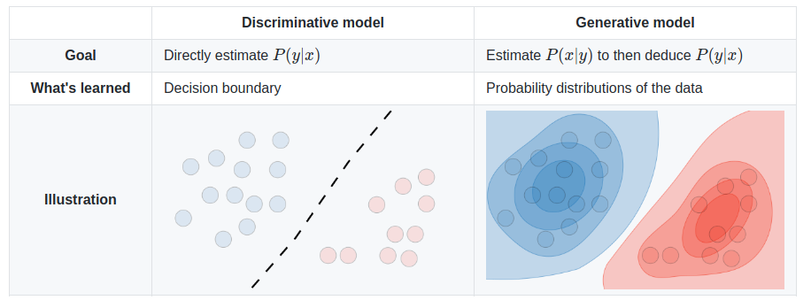

# Discriminative vs Generative Learning Algorithms

The difference between discriminative and generative learning algorithms can be summarized as shown in the following diagram:

Let us go over the various differences between generative and discriminative models.

| | Discriminative Learning Algorithms | Generative Learning Algorithms |
| :--: | :--: | :--: |
|1. | It is a class of techniques belong to supervised learning class | It is a class of techniques used for both supervised learning and unsupervised learning |
|2. | It is used for either classification or regression problems | Apart from classification and regression problems, generative learning algorithms can be used for many other tasks |
| 3. | A discriminative model makes predictions on the unseen data based on conditional probability $p(y\|x)$ | Whereas generative models focus on the distribution of individual classes in a dataset and the learning algorithms tend to model the underlying patterns $p(x\|y)$ or distribution of the data points $p(y)$ |
| 4. | Discriminative models tries to create a boundaries in the data space | Generative models tries to understand and model how the data is distributed across the space |
| 5. | Discriminative models can only predict label, tag or classify the data  | Generative models can produce the data. They focuses on explaining how the data was generated |
| 6. | Outliers have less impact on discriminative models compared to generative models | Outliers impact more on generative models |
| 7. | Computationally cheap | Computationally expensive compared to generative models |
| 8. | Discriminative models need more data compared to generative models as they have weaker assumptions on data | Generative models need fewer data compared to discriminative models as they make stronger assumptions on data |
| 9. | Generative models can work with these missing data | Discriminative models cannot work with missing data |
| 10. | Generative models perform worse if the assumptions are not met | Compared to generative models, discriminative models perform better when the assumptions are violated |
