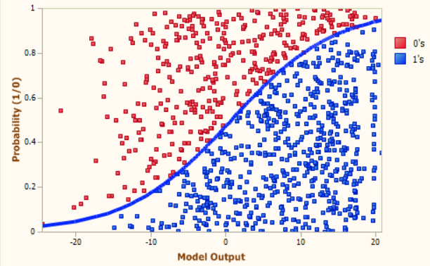

# Generative Learning Algorithms

In supervised learning, we know that labeled training set is available. The labeled data set is of the form $\{(x^i,y^i); i = 1\ldots m\}$. So, the dataset has $m$ training examples. 

In classifications tasks the methods are mainly classified as :

1. Generative Learning Algorithms
2. And Discriminative Learning Algorithms

First, Let's start by talking about discriminative learning algorithms due to its simplicity to understand.

## Discriminative Learning Algorithms

A discriminative classifier tries to model by just depending on the observed data. It makes fewer assumptions on the distributions but depends heavily on the quality of the data (Is it representative? Are there a lot of data?). An example is the Logistic Regression. 

A discriminative model learns the conditional probability distribution: $p(y|x)$, which should be read as "the probability of y given x".

To predict the label y from the training example x, the models evaluate:
$$f(x) = {\underset {y} {\operatorname {arg\,\, max}}}\,\, p(y|x)$$

This can be understood as : choose the value of $y$ such that it maximizes the conditional probability $p(y|x)$.

Another way to understand this equation is that model selects most likely class $y$ for- given $x$. 

This can be visualized as the model creating decision boundaries between the classes. Let us look at the following diagram to understand this :

Here, the decision boundary is the blue line that separates the red classes from the blue class.

To classify a new example the model checks on which side of the decision boundary the example falls on.

Let us look at the example of a classification problem in which we want to learn to distinguish between elephants (y = 1) and dogs (y = 0), based on some features of an animal.

Given a training set, an algorithm like logistic regression tries to find a a decision boundary that separates the elephants and dogs. 

Then, to classify a new animal as either an elephant or a dog, it checks on which side of the decision boundary it falls, and makes its prediction accordingly. This is the way discriminative learning algorithms work.

Now, let us look at the generation learning algorithms and their framework.

