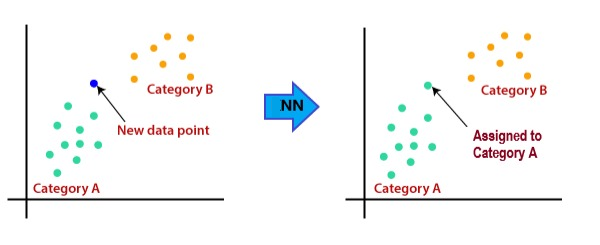

# Introduction to Nearest Neighbor Algorithms

Nearest neighbor algorithms makes the following assumption. It assumes that the points belong to same category or class are similar or close to each other. They center their operating principles around this assumption.

For a new data point, the algorithm finds the available most similar data points and categorizes them accordingly.

Hence, to find the most similar data points, these algorithms store the data points. Nearest neighbor algorithms are called lazy learning algorithms as they do not learn immediately from the training data. Rather, nearest neighbor algorithms store the data points and during the inference process, It performs the action.

Let us understand this concept with diagram below.

Though, nearest neighbor algorithms can be used for both classification and regression, they are mostly used for classification problems. So, we discuss the nearest neighbor algorithm with respect to the classification.

Before discussing the basic nearest neighbor algorithm, let us see what measure they use to find similar data points.

