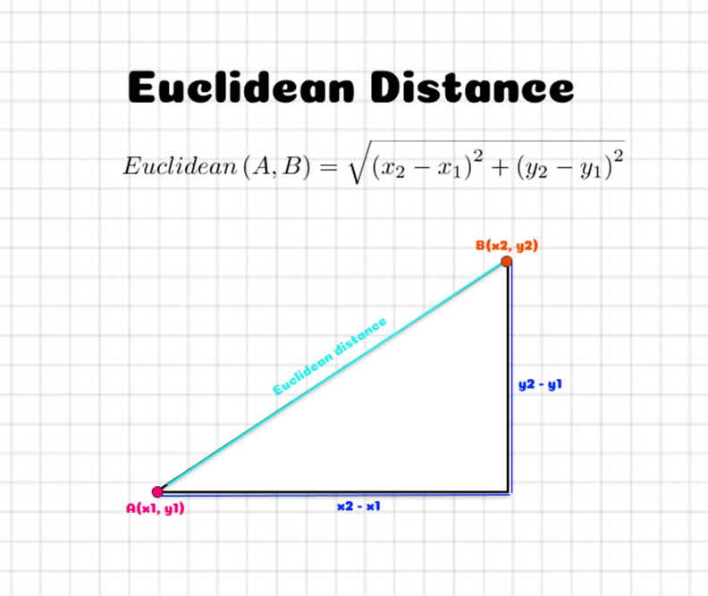

# Similarly Measures for Nearest Neighbors

Similarly measures that nearest neighbors employ is distance. For assigning the class label in the case of classification, they calculate the distance between given data point to all other data points in the training set. For assigning the class label, they choose the class of the nearest data point class.

Let us look at some of the popular distance measures near neighbor classifiers employ. The following are the distance measures :
1. Euclid distance
2. Manhattan distance
3. Minkowski distance 
4. Hamming distance

## Euclid Distance

Euclidean distance between two points in Euclidean space is the length of a line segment between the two points. Euclidean space is defined over real numbers. 

Let us look at how to calculate the distance between two real vectors in the Euclidean space. Let $x$ and $y$ be two $n-$ dimensional real vectors, then Euclidean distance is given by :
$$d(x, y) = \sqrt{(x_1-y_1)^2 + (x_2-y_2)^2 + \ldots +(x_n - y_n)^2}$$

Two dimensional interpretation of the Euclidean distance can be understood by the following diagram:

## Manhattan Distance

Manhattan distance is calculated as absolute distance between two vectors. For two real $n-$ dimensional vectors $x$ and $y$, the Manhattan distance is computed by :
$$d(x,y) = |x_1 - y_1| + |x_2 - y_2| + \ldots +|x_n - y_n|$$

Here, $|z|$ is the absolute value of the $z$. Let us look at the following figure to illustrate Manhattan distance:

In this diagram, both blue line and green line are for Manhattan distance. Whereas, red line which is diagonal represents the Euclidean distance.

## Minkowski Distance

Minkowski distance is the generalization or generalized form of the Euclidean and Manhatten distance. The Minkowski distance for two $n-$ dimensional vectors $x$ and $y$ are given by the following formula:
$$d(x,y) = \left(\sum_{i=1}^n |x_i - y_i|^p\right)^{\frac{1}{p}}$$

Here, $p$ is the integer $(\ge 1)$.

## Hamming Distance

Hamming distance is defined for Boolean vectors. While comparing two binary strings of equal length, Hamming distance is the number of bit positions in which the two bits are different. 

Hamming distance is different from all other distances we have seen. It is widely used in information theory.

With these distances for similarity measures, let us find how the nearest neighbor algorithm classifies the given data points.