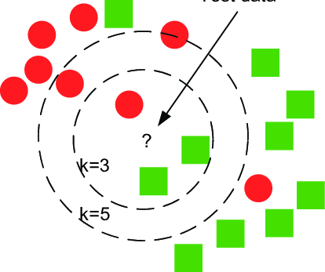

# k-Nearest Neighbor Classifier

k-nearest neighbor classifier popularly known as k-NN is generalization of 1-NN classifier. k-NN is instance based learning algorithm. It means it will not construct a internal model and then classify. Rather, it simply stores all the training points.

k-NN classifier classifies the query data point by computing the simple majority vote of the nearest neighbors of each point. The query point is assigned the data class which has the most representatives within the nearest neighbors of the point.

Let us discuss detailed steps of how k-nearest neighbor classifier works :
1. Pick the distance measure you want to use for finding the similarity
2. Select the k value as any integer $\ge 1$. Most common practice is to choose the odd number
3. Calculate the distance between the query point $x^q$ and the rest of points in the training set
4. Find the $k$ closest points to the query point $x^q$
5. Out of $k$ nearest neighbors, find out which class contains majority of nearest neighbors
6. Assign the class label of the query point $x^q$ as majority of nearest neighbors class

Let us see the diagrammatic illustration of k-nearest neighbor classifier :

Here, inner circle shows the k-nearest neighbors when $k=3$. The question mark corresponding to the query point $x^q$. To choose the class label when $k=1$, let us see how many nearest neighbors belong to each class. Red class has one nearest neighbor whereas green class has two nearest neighbors. 3-NN assigns the green class to $x^q$. 
Whereas, 5-NN assigns the red class to $x^q$ as red class is majority in 5-NN.