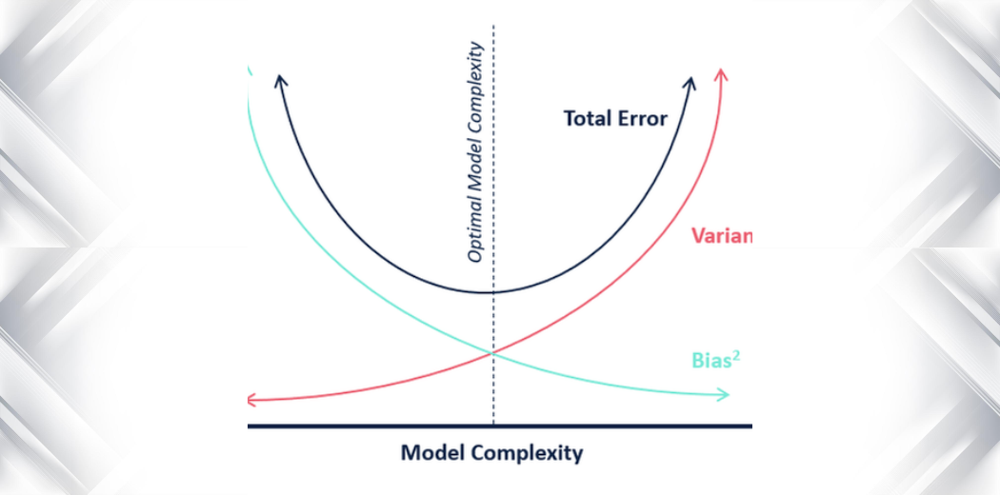

# Bias-Variance Tradeoff

Bias-Variance tradeoff is a central problem in supervised learning. The main reason behind bias-variance is tradeoff is that one wants to choose a machine learning model that both accurately captures the relationships in its training data, but also generalizes well to unseen data. Unfortunately, it is typically impossible to do both simultaneously. 

Let us understand the problem formally. In supervised learning framework, in order to make prediction, we need to construct or learn a function $f$ that predicts $y$ given $x$. 

For a given training set $S=\{(x^i,y^i): i=1,2,\ldots,m\}$, let us assume that $y=f(x)+\epsilon$ is the prediction. Here, $\epsilon$ is noise and $\mathbb{E}[\epsilon] = 0$, $\mathbb{V[\epsilon] = \tau^2}$ (mean and variance). Further, we define the "true" $f$ as :
$$f(x') = \mathbb{E}(y|x=x')$$

Our task now is to construct a hypothesis function $\hat f_m$ given a fixed training set $S$, that mimics the actual function $f$ well on future data points as well. 

In other words, we want $\hat f_m$ to have **good generalization error**. The generalization error of a hypothesis is its expected error on examples not necessarily in the training set. We will look into this topic from the perspective of a mean squared loss/error.

Let $(x_*, y_*)$ be a new unseen data point and the corresponding generalization error is given by (here, expectation is over randomness ) :
$$\begin{aligned}\text{MSE}(\hat f_m) &= \mathbb{E}\left[(y_* - \hat f_m(x_*))^2\right] 
\\&= \mathbb{E}\left[(\epsilon + f(x_*) - \hat f_m(x_*))^2\right] \quad \text{since}\,\, y_* = f(x_*) + \epsilon 
\\ &= \mathbb{E}[\epsilon^2] + \mathbb{E} [(f(x_* )- \hat f_m(x_*))^2] + \mathbb{E}[2 \epsilon (f(x_* )- \hat f_m(x_*))] \\&= \mathbb{E}[\epsilon^2] + \mathbb{E} [(f(x_* )- \hat f_m(x_*))^2] + \mathbb{E}[\epsilon]\,\,\mathbb{E}[2 (f(x_* )- \hat f_m(x_*))] 
\\&=\mathbb{E}[\epsilon^2] + \mathbb{E} [(f(x_* )- \hat f_m(x_*))^2] \quad \text{since}\,\, \mathbb{E}[\epsilon] = 0
\\&= \mathbb{E}[\epsilon^2] + \mathbb{E} [f(x_* )- \hat f_m(x_*)]^2 + \mathbb{V}[f(x_* )- \hat f_m(x_*)] \quad \text{since}\,\,\mathbb{E}[X^2] = \mathbb{V}[X]+ \mathbb{E}[X]^2
\\&= \tau^2 + \mathbb{E} [f(x_* )- \hat f_m(x_*)]^2 + \mathbb{V}[\hat f_m(x_*)] \quad \text{since}\,\,\mathbb{V}[a-X] = \mathbb{V}[X]\end{aligned}$$

Here, $\tau^2$ is irreducible error, $\mathbb{E} [f(x_* )- \hat f_m(x_*)]$ is Bias and $\mathbb{V}[\hat f_m(x_*)]$ is Variance. So, the generalization error of is given by :
$$ \text{generalization error} = (\text{Bias})^2 + \text{Variance} + \text{irreducible error}$$

Now, let us look at the individual errors :

1. **The bias error** is an error from erroneous assumptions in the learning algorithm. High bias can cause an algorithm to miss the relevant relations between features and target outputs.

2. **The variance** is an error from sensitivity to small fluctuations in the training set. High variance may result from an algorithm modeling the random noise in the training data.

3. **The irreducible error** appears only in the prediction setting, as it is an artifact of the noise in the test example (there is no such test example in the inference
setting).

The noise in the training data contributes to the Variance term, and the noise in the test example manifests itself as the
irreducible error term.

In order to minimize the generalization error, we need to reduce one or more of the decomposed components. There is nothing we can do to reduce irreducible error, since it is just noise in the data (i.e., the same $x$ could have different $y$ values in different examples). Thus we are left with balancing the Bias and Variance terms.

It is important to have low Bias, as the model needs to learn well on the training data. However, simply having a model with low bias is not enough and minimizing variance is also important, if not more important. But, if we are to take variance into consideration, we now have to sacrifice some ability to predict the training set well in hopes of obtaining a model that is closer to the truth. This causes the tradeoff in bias and variance. We cannot reduce one error without compromising on the other.

Let us look at the diagram below to understand the tradeoff :

Here, their is sweet spot where bias and variance are relatively low with respect to model complexity. We need to choose the model complexity carefully to reduce the tradeoff.