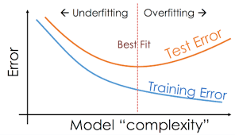

# Overfitting and Underfitting

We can relate the Bias and Variance decomposition to commonly used terms in machine learning known as overfitting and underfitting. In machine learning, we often observe the performance difference between the training set and test set. Often models perform well on training set and perform poorly on test set. Most of the times, the reason behind this is due to the fact that the model is overfitting to the training set.

## Overfitting

Let us look what is overfitting. When a complex model (high degree polynomials, big neural networks etc.) trained on a lot of data, it starts learning from the noise and inaccurate data entries in the data set. By noise we mean those data points in the dataset which don't really represent the true properties of your data, but only due to a random chance. Resulting in a model that is not able to generalize well for the data it has not seen in the dataset. Let us see the diagram below.

In a nutshell, Overfitting refers to High variance and low bias. Overfitting relates to having a High Variance model or estimator. To fight overfitting, we need to focus on reducing the Variance of the estimator. To do this, one of the popular techniques used are the regularization, obtain larger data set, decrease number of features, use a smaller model, etc. We will look into the regularization technique and feature and model selection techniques in the later sections.

## Underfitting

Underfitting is when a model performs poorly on the training set itself. This is usually due to the fact that the model is simple to represent the training set data. Let us see the diagram below.

Here, the underfitting is happening because the model is not able to capture the data distribution well as it is a simple model (which is a line in this case).

Underfitting relates to having a High Bias model or estimator. To fight underfitting, we need to focus on reducing the Bias in the estimator, such as: decrease regularization, use more features, use a larger model, etc. Let us see the effects of overfitting and underfitting on a training and test errors.

As shown in the diagram, for the right model complexity both training and test errors are low. Now, let us look into some of the techniques to control overfitting and underfitting.