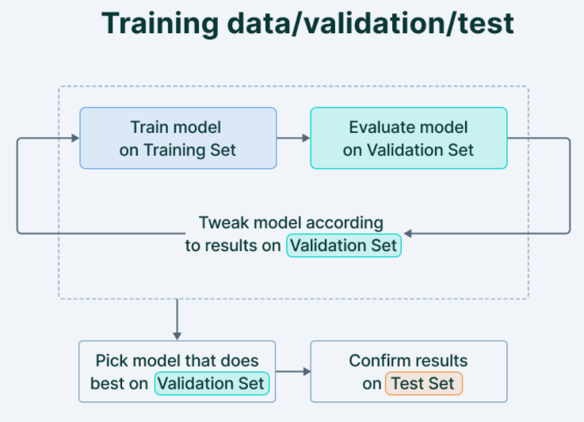

# Cross-Validation

Cross-validation is one of the popular model selection techniques. Before, going into the cross-validation, let us understand the concept of splitting the dataset. In supervised learning, the dataset is split into the following three parts:
1. training set
2. validation set
3. test set

The training set is used to train the model, and the test set is used to evaluate the model. Whereas, the validation set is to be used to evaluate and select the model.

## The Training Set
It is the set of data that is used to train and make the model learn the hidden features/patterns in the data.

In each epoch, the same training data is fed to the machine learning model repeatedly, and the model continues to learn the features of the data.

The training set should have a diversified set of inputs so that the model is trained in all scenarios and can predict any unseen data sample that may appear in the future.

## The Validation Set
The validation set is a set of data, separate from the training set, that is used to validate our model performance during training.

This validation process gives information that helps us tune the model's hyperparameters (e.g: $k$ in k-NN algorithm) and configurations accordingly. It is like a critic telling us whether the training is moving in the right direction or not.

The model is trained on the training set, and, simultaneously, the model evaluation is performed on the validation set after every epoch.

The main idea of splitting the dataset into a validation set is to prevent our model from overfitting i.e., the model becomes really good at classifying the samples in the training set but cannot generalize and make accurate classifications on the data it has not seen before.

## The Test Set
The test set is a separate set of data used to test the model after completing the training.

It provides an unbiased final model performance metric in terms of accuracy, precision, etc. To put it simply, it answers the question of "How well does the model perform?"

## How to split the dataset ?

There is no standard way to split the dataset into training, validation and test sets. However, some of the commonly used techniques are:
1. If the data set is large enough, we can randomly split the data into training, validation and test sets into the following proportions:
    - Training set: 60%
    - Validation set: 20%
    - Test set: 20%
2. If the data set is small, we can use a stratified sampling method to split the data into training, validation and test sets into the following proportions: 
    - Training set: 80%
    - Validation set: 10%
    - Test set: 10%
3. If the data set is very big, we can use a random sampling method to split the data into training, validation and test sets into the following proportions:
    - Training set: 98%
    - Validation set: 1%
    - Test set: 1%
4. If the model has many hyperparameters, then we need bigger validation set.

With this, idea of splitting the dataset into training, validation and test sets, let us understand one of the popular model selection techniques called cross-validation.