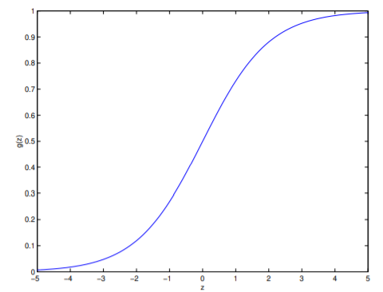

# Sigmoid Function

Sigmoid function or logistic function given by : $$g(z) = \frac{1}{1+e^{-z}}$$

We used the sigmoid function $g$ in logistic regression's hypothesis function. Here, is a plot that shows logistic function or sigmoid function $g(z)$.

Let us look at some properties of a sigmoid function.

---
